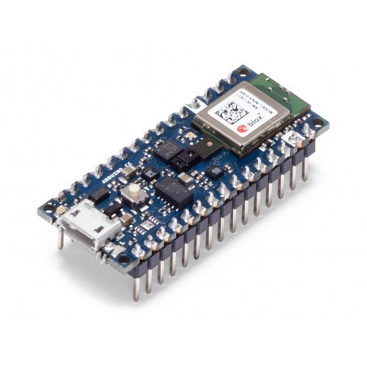
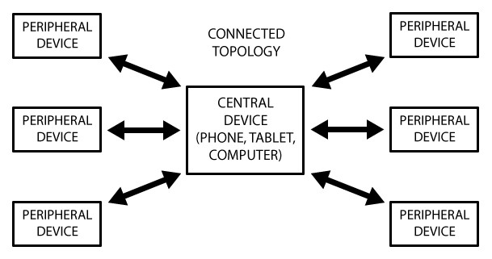
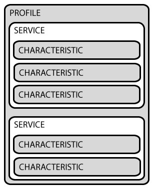

# Frist Steps with Ardunion nano 33 Sense BLE
First steps with Arduino nano 33 sense BLE, as an example we will use it to make a wereable that will send us the information of the IMU. To receive from the computer we will use the Bleak library. 




## Description ##

The board for less than € 35 it i a very interesting option to do projects and offers a number of sensors:

  • 9-axis inertia sensor.
  
  • Humidity and temperature sensor.
  
  • Barometric sensor
  
  • Gesture sensor, proximity, color, light
  
  • Microphone
  
  • BLE: bluetooth low consumption 
  
[Ble](https://en.wikipedia.org/wiki/Bluetooth_Low_Energy) refers to bluetooth low energy, but it is not that it consumes less, it is a totally different technology. If you were used to working with the Bluetooth [HC-06](https://tienda.bricogeek.com/modulos-bluetooth/1351-modulo-bluetooth-hc-06.html?search_query=hc-06&results=1) through serial, this guide may help you understand a little how to deal with this new partner.




The example that we are going to use is a simple code where we will find the value of the IMU in a string and we will publish it in the central. And from the computer we will send a simple char that will control the status of the arduino's led.

## Instalation  ##

It can be a bit cumbersome to install all the libraries involved in using the Arduino nano 33 Sense. If you follow the [tutorial](https://www.arduino.cc/en/Guide/NANO33BLESense) on the arduino page it is simple.

```ruby

  #include <ArduinoBLE.h> 	     //Bluetooth ble
  #include <Arduino_LSM9DS1.h>   // IMU //
  #include <PDM.h>               // Digital microphone
  #include <Arduino_APDS9960.h>  // Gesture sensor //
  #include <Arduino_LPS22HB.h>   // Pressure //
  #include <Arduino_HTS221.h>    // Relative humidity and temperature //

 ``` 
**Almost all can be installed from the library manager**

On the computer we are going to use python, for this we will install the bleak library,to use BLE and aiconsole to enter command through terminal. (I used this example from windows)

```ruby
  pip install bleak
  pip install aioconsole
```

## Software ## 

In short, in the Arduino we are going to have to create a series of services with some properties, read, write or notification. And from the Python program in Windows we will connect to those services when we need them and we will obtain the data.

### Arduino ###

```ruby
  #include <ArduinoBLE.h>
  #include <Arduino_LSM9DS1.h> //IMU

  float Ax, Ay, Az, Gx, Gy, Gz, Mx, My, Mz;
  const int BUFFER_SIZE = 64;
  char msgprint[BUFFER_SIZE];


  const char* uuid_service="00001101-0000-1000-8000-00805f9b34fb";  // profile
  const char* uuid_string="00001143-0000-1000-8000-00805f9b34fb";   // String info of the IMU
  const char* uuid_char="00001150-0000-1000-8000-00805f9b34fb";     //char to control LED

  BLEService customService(uuid_service);
  BLECharacteristic Send_string(uuid_string,BLERead | BLENotify ,BUFFER_SIZE,false);
  BLECharCharacteristic led_control(uuid_char, BLERead | BLEWrite);// 0,1
 
  
```

The uuid addresses have a 16-bit or 128-bit format, at first I thought they could be invented, and they can, but the first value 0x1101 or 0x1143 represents the GATT, which depending on the value that is being sent, [here](https://www.bluetooth.com/specifications/gatt/services/) you can see a list of existing profiles. This is intended to make the protocol more stable between manufacturers. If you put a specific profile, in Android or ios applications that name will appear in the service. If not, the entire address will appear. 

We define three, the main one is the one that will contain the rest of the services, which would be the “profile”. The second is the address where we will send the string, as characteristics you can make a reading order or receive notifications of changes. And the third is where we will read and write in a char that we will use to activate the led.



```ruby
  void setup() {
  Serial.begin(9600); //to debug
  if (!IMU.begin()) {
    Serial.println("Failed to initialize IMU!");
    while (1);
  }
  if (!BLE.begin()) {
    Serial.println("starting BLE failed!");
    while (1);
  }
  BLE.setLocalName("IMU_test"); // name of Bluetooth
  BLE.setAdvertisedService(customService.uuid());
  customService.addCharacteristic(Send_string); // add characteristic
  customService.addCharacteristic(led_control); // add characteristic
  BLE.addService(customService);

  
  led_control.setValue(‘0’); // initial values 0x30 o 0 en Asccii
  
  // Events 
  led_control.setEventHandler(BLEWritten,led_Update); // event to write 
  BLE.setEventHandler(BLEConnected, onBLEConnected); // event to connect optional
  BLE.setEventHandler(BLEDisconnected, onBLEDisconnected); // event to disconned optional
    
  BLE.advertise();
  Serial.println(BLE.address());// Print the mac address 
  pinMode(13,OUTPUT);
}

```
We initialize the Serial, the IMU and the BLE connection. We add the name to the bluetooth, activate the profile and add the [characteristics](https://www.arduino.cc/en/Reference/ArduinoBLEBLECharacteristicBLECharacteristic) that we have defined previously. If one of these services needs to initialize it, it becomes "led_control.setValue ('0')".
The events, “setEventHandler” define functions that are called when the condition properly described occurs, in this case when we want to write a char or when bluetooth is connected or disconnected.

```ruby

  void led_Update(BLEDevice central, BLECharacteristic characteristic) {
   char aux=led_control.value();
   if (aux=='1') digitalWrite(13,HIGH); // '1' o 0x31 
   else  digitalWrite(13,LOW); 
}

void onBLEConnected(BLEDevice central) {
  Serial.print("Connected event, central: ");
  Serial.println(central.address());
 }

void onBLEDisconnected(BLEDevice central) {
  Serial.print("Disconnected event, central: ");
  Serial.println(central.address()); // util to  know which mac address is your board
 }

```

And finally we have the loop, where we manage what to do once someone has connected to us, in our example we will read the values of the IMU, we will group them in a string that we will send. 


```ruby
  void loop() {
  BLEDevice central = BLE.central();
  if (central) {
    while (central.connected()) {
      if (IMU.accelerationAvailable()&& IMU.gyroscopeAvailable() && IMU.magneticFieldAvailable()) {
        IMU.readAcceleration(Ax, Ay, Az);
        IMU.readGyroscope(Gx, Gy, Gz);
        IMU.readMagneticField(Mx, My, Mz);
        sprintf(msgprint, "%.2f,%.2f,%.2f,%.2f,%.2f,%.2f,%.2f,%.2f,%.2f,", Ax, Ay, Az, Gx, Gy, Gz, Mx, My, Mz);
        Serial.println(msgprint);
        Send_string.writeValue(msgprint, sizeof(msgprint));
      
    }
  }
}

```
The Arduino Ide takes time to compile and then this board has another peculiarity, it has two ports, one for monitoring and the other for programming, pressing the reset twice in a row enters programming mode, select that port to send the program. Once done you will have to change to the other port to look at the serial.

### Python ###

The calls to the services to be made are asynchronous, and the program will stop to wait for the LED control instruction. If 'x' is sent, it will break the loop, disconnect and exit the program.

```ruby
  import logging
  import asyncio
  import datetime

  from aioconsole import ainput
  from bleak import BleakClient, BleakError

  read_string_uuid = "00001143-0000-1000-8000-00805f9b34fb" #servicio de lectura de string
  led_control_uuid = "00001150-0000-1000-8000-00805f9b34fb" #servicio control del led


  #global variables
  Ax=0.0;Ay=0.0;Az=0.0;Gx=0.0;Gy=0.0;Gz=0.0;Mx=0.0;My=0.0;Mz=0.0
  
  async with BleakClient(address, loop=loop) as client:
        while(1):
            x = await client.is_connected() #  Connect to address
            log.info("Connected: {0}".format(x)) 
            log.info("Starting notifications/indications...")
            
  # Start receiving notifications, which are sent to the `data_handler method`
            await client.start_notify(indication_characteristic_uuid, data_handler)# read the string
            
            # wait for instruction to crontrol the led
            keyboard_input = await ainput("Control Led [0,1]: ")
            if keyboard_input== 'x':
                break
            bytes_to_send = bytearray(map(ord, keyboard_input))
            await client.write_gatt_char(led_control_uuid, bytes_to_send, response=True)

            # Send a request to the peripheral to stop sending notifications.
            await client.stop_notify(indication_characteristic_uuid)
            log.info("Stopping notifications/indications...")

```
Once connected, the data contains 64 bytes, which is how we have defined the buffer and in data_handler we process that data. The system then pauses waiting for keyboard input. With a 1 read as a char, the Arduino led turns on, x closes the application and anything else turns the led off.

```ruby
  def data_handler(sender, data):
        global Ax,Ay,Az,Gx,Gy,Gz,Mx,My,Mz
        #log.info("{0}: {1}".format(sender, data))
        data_storage.append((datetime.datetime.utcnow().timestamp(), data))
        aux = bytearray(data)
        datos = stringdata = aux.decode('utf-8')
        msg = datos.split(",")
        Ax=float(msg[0])
        Ay=float(msg[1])
        Az=float(msg[2])
        Gx=float(msg[3])
        Gy=float(msg[4])
        Gz=float(msg[5])
        Mx=float(msg[6])
        My=float(msg[7])
        Mz=float(msg[8])
        print("Accelerometro [xyz]:"+str(Ax)+", "+str(Ay)+", "+str(Az))
        print("Gyroscope [xyz]:"+str(Gx)+", "+str(Gy)+", "+str(Gz))
        print("Magnetometre [xyz]:"+str(Mx)+", "+str(My)+", "+str(Mz))

```
We receive 64 bytes in a bytearray, by means of a Split we separate them by commas and the value msg [9] is disposable, they are all zero. The rest we convert to float values in this case. And we visualize in terminal by means of the print.


### Update ###

Sometimes the bluetooth stays connected even though the Python program has stopped, which forces you to reset the arduino manually. One way to prevent this from happening is to program it to reset every X time. If your application allows this type of behavior, here we explain how.

```ruby
  
  //Configure WDT in Ardunio.
  NRF_WDT->CONFIG         = 0x01;     // Configure WDT to run when CPU is asleep
  NRF_WDT->CRV            = 983041;// Timeout set to 30 seconds, timeout[s] = (CRV-1)/32768
  NRF_WDT->RREN           = 0x01;     // Enable the RR[0] reload register
  NRF_WDT->TASKS_START    = 1;        // Start WDT 

```

This way the Arduino will restart every 30 seconds. To prevent this from happening there is an instruction that will restart the time count. We generate a new reset_Char service, which will have an event, restart the count. If we are connected and send a signal to the watchdog every so often, the Arduino will work without problems. Otherwise it will reset and allow us to reconnect. 

```ruby
// create a new service  
BLECharCharacteristic reset_Char("00001264-0000-1000-8000-00805f9b34fb", BLERead | BLEWrite);//0,1

//In the setup()
customService.addCharacteristic(reset_Char);
reset_Char.setValue('0');
reset_Char.setEventHandler(BLEWritten, reset_Char_Update);

// Function

void reset_Char_Update(BLEDevice central, BLECharacteristic characteristic) {
  int aux = reset_Char.value();
  if (aux == '1')  NRF_WDT->RR[0] = WDT_RR_RR_Reload;    // Reload the WDTs RR[0] register
  reset_Char.setValue('0');
} 

```


 
